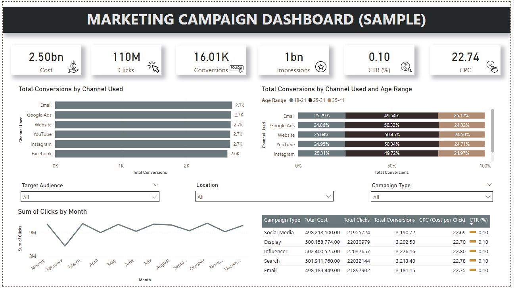

# 📊 Marketing Campaign Dashboard (Power BI)

Este es un dashboard de ejemplo construido en Power BI para analizar campañas de marketing digital a través de diferentes canales como redes sociales, email, y anuncios pagados.

## 🧩 Objetivos

- Analizar el rendimiento de campañas de marketing según canal, edad, tipo de campaña y ubicación.
- Visualizar indicadores clave (KPIs) como Costo Total, Clics, Conversiones, CPC y CTR.
- Permitir exploración interactiva mediante filtros dinámicos.

## 🖼️ Visualizaciones incluidas

- Tarjetas con KPIs y íconos personalizados.
- Barras horizontales de conversiones por canal.
- Barras apiladas por canal y grupo etario.
- Línea temporal de clics por mes.
- Tabla detallada con métricas por tipo de campaña.
- Filtros por audiencia, ubicación y tipo de campaña.

## 📎 Captura del dashboard

## 🛠️ Herramientas usadas

- Power BI Desktop
- Íconos descargados de [Flaticon](https://www.flaticon.com/)
- Dataset ficticio simulado para fines educativos

## ✨ Próximos pasos

Este es el primero de tres dashboards que estoy desarrollando como parte de mi portafolio de analista de datos. Próximamente incluiré un análisis detallado de campañas publicitarias reales con storytelling avanzado y tooltips personalizados.

---

© 2025 Ritshu Crispin
